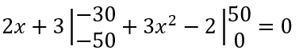

&nbsp; [](https://www.nuget.org/packages/EMDD.KtExpressions/)[](https://www.nuget.org/stats/packages/EMDD.KtExpressions?groupby=Version&groupby=ClientName&groupby=ClientVersion)[](https://github.com/marlond18/EMDD.KtExpressions/actions/workflows/runTest.yml)
&nbsp; 
----------------
# EMDD.KtExpressions
a library for basic math expression manipulations

## Requirements

[.Net 5.0.102 sdk](https://dotnet.microsoft.com/download/dotnet/5.0) or greater

## Nuget Package Usage

https://www.nuget.org/packages/EMDD.KtExpressions/

`<PackageReference Include="EMDD.KtExpressions" Version="*.*.*" />`

## Motivation
- Yeah basically, I needed some mathematical expression implementations for my masters thesis in civil engineering which requires the manipulation of piecewise function. I was unable to find one that fits needs so I had to build it from scratch.


## Usage
```EMDD.KtExpressions.Expression.Expression``` can be instantiated by supplying array of `Term`, array of [KtPolynomials](https://github.com/marlond18/EMDD.KtPolynomials), array of numbers (double, int types etc), with the option to imclude the limit of the functions


Let's say you want to instantiate a function



it can be written as
```c#
//Create the equations first
var eq1 = EMDD.KtPolynomials.KtPolynomial.Create(2, 3);
var eq2 = EMDD.KtPolynomials.KtPolynomial.Create(3, 0, -2);

//create the limits
var lim1= new EMDD.KtExpressions.Limits.Limit(-50, -30);
var lim2= new EMDD.KtExpressions.Limits.Limit(0, 50);

//instantiate the Expression by providing equation parameters in valuetuple form
var expression = new EMDD.KtExpressions.Expression.Expression((eq1, lim1), (eq2, lim2));
```

### ```KtPolynomials``` Methods
#### Basic Math Ops
- addition, subtraction, multiplications with other expressions, multiplications with constants, division by other expressions, and division by constants
#### Other Functionalities
- representation fractions of expressions
- simplification of basic expression
- representation of piece-wise functions